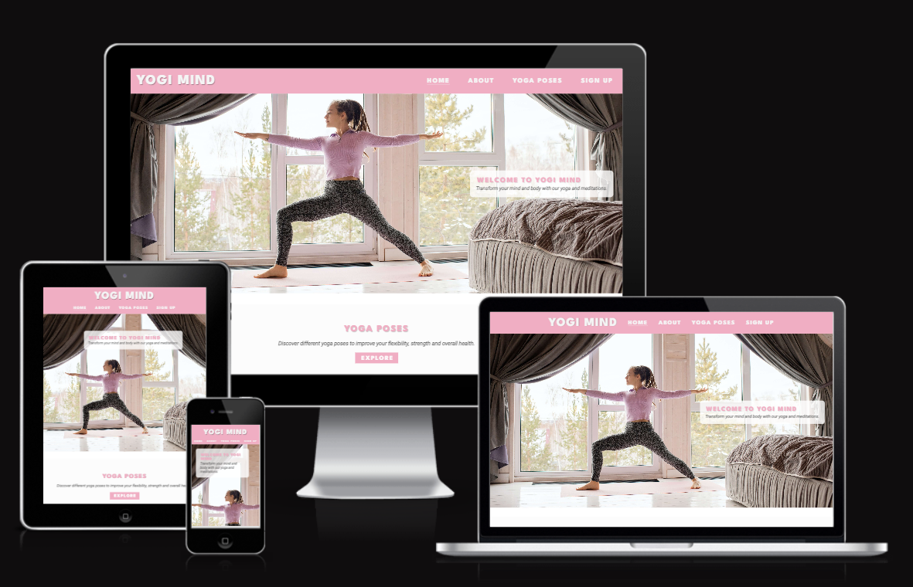
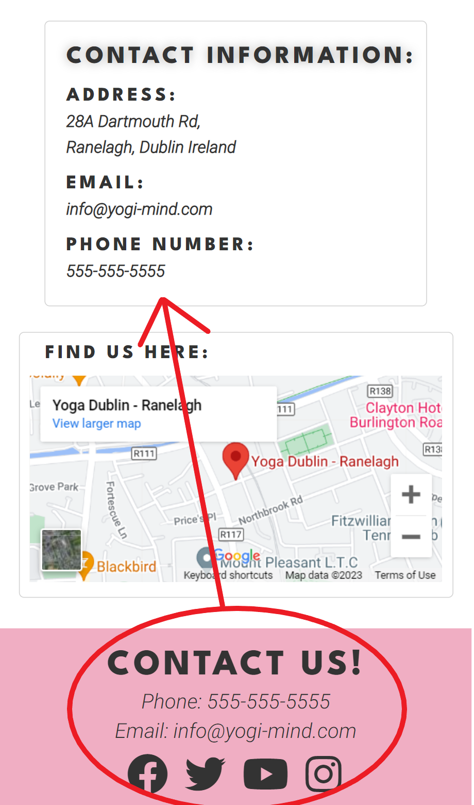

# Yogi Mind

(Developer: Anthony Haj Ibrahim)

[Live webpage](https://anthonyhaj.github.io/yogi-mind-MS1/)

## Table of Contents

1. [Introduction](#introduction)
2. [User Experience](#user-experience)
    1. [User Stories](#user-stories)
3. [Design](#design)
    1. [Design Choices](#design-choices)
    2. [Colour](#colours)
    3. [Fonts](#fonts)
    4. [Structure](#structure)
    5. [Wireframes](#wireframes)
4. [Technologies Used](#technologies-used)
    1. [Languages](#languages)
    2. [Frameworks & Tools](#frameworks-&-tools)
5. [Features](#features)
6. [Testing](#validation)
    1. [HTML Validation](#HTML-validation)
    2. [CSS Validation](#CSS-validation)
    3. [Accessibility](#accessibility)
    4. [Performance](#performance)
    5. [Device testing](#performing-tests-on-various-devices)
    6. [Browser compatibility](#browser-compatability)
    7. [Testing user stories](#testing-user-stories)
8. [Bugs](#Bugs)
9. [Deployment](#deployment)
10. [Credits](#credits)
11. [Acknowledgements](#acknowledgements)

## Introduction

Welcome to my website! Yogi Mind is a site that aims to showcase basic yoga practices and provides an opportunity for users to sign up or contact us for more information. Take a look around, explore our pose library, and don't hesitate to reach out if you have any questions. Thank you for visiting!

## User Experience

### User Stories
1. As a first time user, I want to know where Yogi Mind is located.
2. As a first time user, I want to know how I can contact Yogi Mind.
3. As a first time user, I want to know what Yogi Mind is about.
4. As a first time user, I want to know what techniques there are to learn.

## Design

### Color
I designed my website with simple coloring and with navigation. The color scheme calming and cozy with a shade of pink and a mixture of greys and whites. I chose my colors by seeing different color schemes and contrasts on brandcolor.net. My design is clean and minimalistic with a focus of simplicity and ease of us. Below I have included the color scheme using Adobe Color.

### Fonts
Using Google Fonts, The first font for the headings and logo was League Spartan and the secondly for texts and paaragraphs I used Roboto which matched very well together giving a warm look.

### Structure
- A home page with a hero image, an explore section, and an about us section
- A page of different yoga position and how to do them
- An about navigation which takes the user to the about us section
- A sign up page with form and contact information including location map

### Wireframes 

Homepage

Yoga Poses

Sign Up

## Technologies Used

### Languages
- HTML
- CSS

### Frameworks & Tools
- Git
- Gitpod
- Code Anywhere
- Balsamiq
- Adobe Color
- Tiny png
- Google Fonts
- Font Awesome

## Features

### Nav Bar and Logo
- Seen on all pages
- Small text color transition on hover
- Displays underline for current page

### Explore Section
- A small introduction to the site
- A button that allows the user to explore Yoga Poses page

### About Us 
- A description of the websites goals and features
- Can also be reached through the navigation bar

### Footer
- Seen on all pages 
- Contact us and info included in footer
- Social media links 

### Yoga Poses page
- A page showing different yoga poses with listed instructions 
- Photos of poses showing each technique

### Sign Up form 
- A form for subscribing to the sites newsletter
- All fields texts cannot be submitted empty
- Text boxes for First name, Last name, and Email
- A button to submit

### Contact Information
- Information on address, phone number, and email address.

### Map
- Interactive google map to easily find sites location

## Validation

### HTML Validation
Using the W3C HTML Validation tool

Homepage

Yoga Poses

Sign Up

### CSS Validation
Using the W3C Jigsaw CSS Validation tool full stylesheet

Full stylesheet

Full repo

### Accessibility 
Using Wave web accessibility tool. All pages pass with no errors besides contrast errors

Homepage

Yoga Poses

Sign Up

### Performance
Using lighthouse on google devoloper tools, 

Homepage

Yoga Poses

Sign Up

### Device Testing
I have tested on multiple devices including small devices and responsiveness is working very well. The devices i have tested are:
- Lenovo Thinkpad (PC)
- iPad Mini
- iPhone X
- iPhone 7
- iPhone 12 Pro
All links and pages respond very well, I have also tested all devices on google developer tools.

### Browser Compatability 
- Tested on Google Chrome
- Tested on Firefox
- Tested on Microsoft Edge
All browsers respond well. All fonts, links, and images work as expected.

### Testing User Stories

1. As a first time user, I would like to know how to locate Yogi Mind

- From the Homepage, click on the sign up page to locate the map.
- Additional information of location address can be found above the map.
**Tested on all devices, works as expected**

Map

2. As a first time user, I would like to know how i can contact Yogi Mind.

- From the Homepage, click on the sign up page to locate Contact Information.
- Contact Information including the email and phone number are also found in the footer.
**Tested on all devices, works as expected**

Contact

3. As a first time user, I would like to know what Yogi Mind is about.

- From any page on the website the About navigation link will redirect the user to the About Us section which is located on the Homepage.
- Also within the About Us section is a button for users who would like to subscribe to the newsletter.
**Tested on all devices, works as expected**

About Us

4. As a first time user, I would like to know what techniques there are to learn.

- From the navigation menu clicking on Yoga Poses will direct the user to images and instructions on different yoga poses.
- Yoga Poses page can also be accessed from the Homepage as there is an explore button.
**Tested on all devices, works as expected**
 

Yoga Poses

## Bugs

1. Navigation bar gets distorted on smaller screens
- Fix: Added a media query for medium and small screen adjuststing the font size and navigation margin

2. .current for my anchor tags was only showing on Home anchor on other pages
- Fix: Made sure my navigation a elements had the correct current class for each page

3. Column for on form box would only display in a row horizontally
- Fix: Changed display to flex column

4. Map was too wide on sign up page
- Fix: Adjusted the values on the embedded google maps href

## Deployment

1. The site was deployed to GitHub pages. This is how:
2. In the GitHub repository, navigate to the Settings tab and into pages
3. From the pages section, under build and deployment i choose my main root branch
4. Once the master branch has been selected, refresh the page and it will appear as a link at the top of the pages section of settings.

## Credits

### Content

1. Social media icons were taken from fontawesome.com

### Media

- All photos on Yogi Mind are credited to [Alexy Almond](https://www.pexels.com/@alexy-almond/)

### Code
- Code of footer social media links and hero section inpired by the CI Love Running project.

## Acknowledgements
- I would like to credit Ana Runje for a great readme template.
- I would like to thank Code Institute for a wonderful learning experience.
- I would also like to thank my mentor Mo Shami for guiding me through this project.

  

