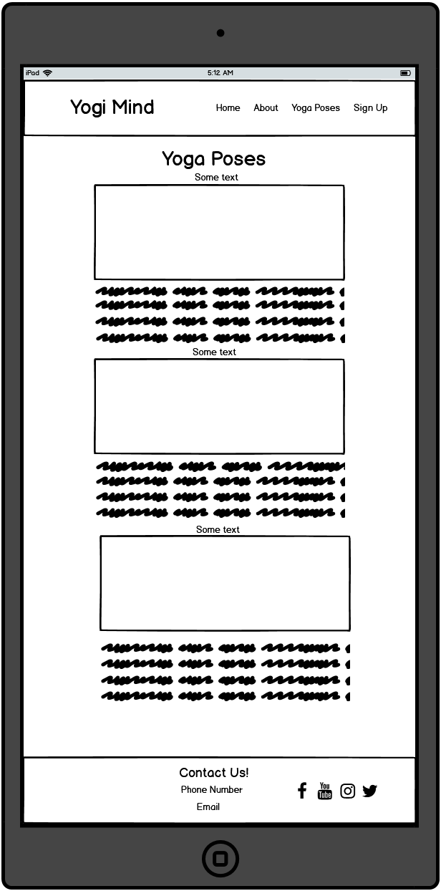

# Yogi Mind

(Developer: Anthony Haj Ibrahim)

[Live webpage](https://anthonyhaj.github.io/yogi-mind-MS1/)

## Table of Contents

1. [Introduction](#introduction)
2. [User Experience](#user-experience)
    1. [User Stories](#user-stories)
3. [Design](#design)
    1. [Design Choices](#design-choices)
    2. [Colour](#colours)
    3. [Fonts](#fonts)
    4. [Structure](#structure)
    5. [Wireframes](#wireframes)
4. [Technologies Used](#technologies-used)
    1. [Languages](#languages)
    2. [Frameworks & Tools](#frameworks-&-tools)
5. [Features](#features)
6. [Testing](#validation)
    1. [HTML Validation](#HTML-validation)
    2. [CSS Validation](#CSS-validation)
    3. [Accessibility](#accessibility)
    4. [Performance](#performance)
    5. [Device testing](#performing-tests-on-various-devices)
    6. [Browser compatibility](#browser-compatability)
    7. [Testing user stories](#testing-user-stories)
8. [Bugs](#Bugs)
9. [Deployment](#deployment)
10. [Credits](#credits)
11. [Acknowledgements](#acknowledgements)

## Introduction

Welcome to my website! Yogi Mind is a site that aims to showcase basic yoga practices and provides an opportunity for users to sign up or contact us for more information. Take a look around, explore our pose library, and don't hesitate to reach out if you have any questions. Thank you for visiting!

## User Experience

### User Stories
1. As a first time user, I want to know where Yogi Mind is located.
2. As a first time user, I want to know how I can contact Yogi Mind.
3. As a first time user, I want to know what Yogi Mind is about.
4. As a first time user, I want to know how I can sign up for newsletters.

## Design

### Color
I designed my website with simple coloring and with navigation. The color scheme calming and cozy with a shade of pink and a mixture of greys and whites. I chose my colors by seeing different color schemes and contrasts on brandcolor.net. My design is clean and minimalistic with a focus of simplicity and ease of us. Below I have included the color scheme using Adobe Color.

### Fonts
Using Google Fonts, The first font for the headings and logo was League Spartan and the secondly for texts and paaragraphs I used Roboto which matched very well together giving a warm look.

### Structure
- A home page with a hero image, an explore section, and an about us section
- A page of different yoga position and how to do them
- An about navigation which takes the user to the about us section
- A sign up page with form and contact information including location map

### Wireframes 

Homepage

Yoga Poses

Sign Up

## Technologies Used

### Languages
- HTML
- CSS

### Frameworks & Tools
- Git
- Gitpod
- Code Anywhere
- Balsamiq
- Adobe Color
- Tiny png
- Google Fonts
- Font Awesome

## Features

### Nav Bar and Logo
- Seen on all pages
- Small text color transition on hover
- Displays underline for current page

### Explore Section
- A small introduction to the site
- A button that allows the user to explore Yoga Poses page

### About Us 
- A description of the websites goals and features
- Can also be reached through the navigation bar

### Footer
- Seen on all pages 
- Contact us and info included in footer
- Social media links 

### Yoga Poses page
- A page showing different yoga poses with listed instructions 
- Photos of poses showing each technique

### Sign Up form 
- A form for subscribing to the sites newsletter
- All fields texts cannot be submitted empty
- Text boxes for First name, Last name, and Email
- A button to submit

### Contact Information
- Information on address, phone number, and email address.

### Map
- Interactive google map to easily find sites location

## Validation

### HTML Validation
Using the W3C HTML Validation tool

Homepage

Yoga Poses

Sign Up

### CSS Validation
Using the W3C Jigsaw CSS Validation tool full stylesheet

Full stylesheet

Full repo

### Accessibility 

